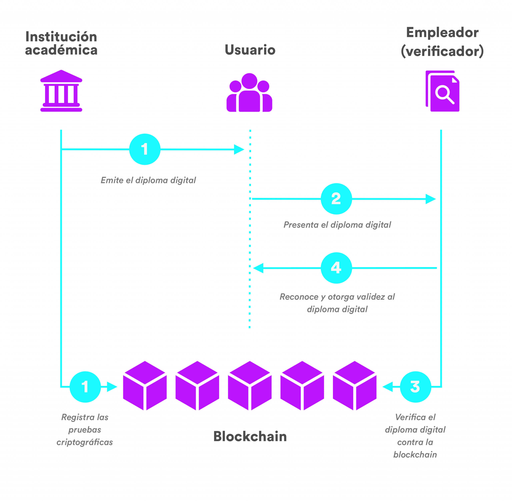
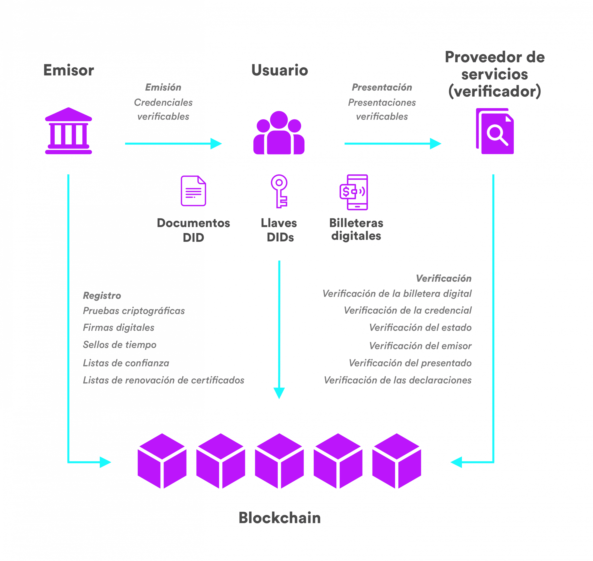

## Descripción del Proyecto

#### Los nuevos estándares tecnológicos y europeos (Blockchain, identidad digital autosoberana SSI, eIDAS2 y EBSI) aplicables en un sistema de credenciales verificables para una formación  modular y acumulable de la nueva FP.

Cert es el proyecto que realizará la implementación de un sistema de acreditación de
titulaciones adaptado al marco de la nueva ley de Formación Profesional utilizando el
estándar europeo EBSI basado en la tecnología Blockchain. Permitirá también que las
entidades empleadoras puedan acreditar los logros obtenidos por los trabajadores.
El ciudadano siempre tendrá control sobre quién puede visualizar su “cartera digital de
acreditaciones -wallet-”.
Significa un cambio radical que implica la simplificación de trámites, garantía de veracidad de
la información registrada en el sistema y mejora en el intercambio de información entre los
diferentes sistemas formativos y laborales, incluyendo posibles convalidaciones.
EBSI está basado en web3: “digital wallets”, credenciales verificables (eDiploma) y Blockchain.


### Como funciona?

El centro de Formación Profesional  (entidad emisora) que emite una credencial sobre un alumno indicando que ha superado un título. 
El alumno (propietario de la identidad) acepta dicha credencial (avalada por una entidad emisora, su centro educativo) incorporándola a su identidad digital, que estará en una especie de “cartera digital”, un programa que la gestiona.
El alumno realiza una solicitud para trabajar en una empresa, que solicita verificar la credencial emitida por el centro educativo para asegurarse que el alumno dispone del título.



### Ejemplo de flujo integrado Smartcontract, DID y VC

**DID** Identifica al usuario o entidad

**VC** Es el "título" 

**Smartcontract** se usan para registrar, actualizar o revocar los DIDs y sus Documentos DID en la blockchain.

Esto permite que otras partes validen la autenticidad del DID sin intervención centralizada.

**Emisión de Identidad:** Una entidad (como una centro de FP) crea un DID y emite una VC (ej., un diploma) vinculada al DID del estudiante.
Registro en **Smart Contract:** El smart contract registra el estado de la VC como válida y confirma que proviene de una entidad confiable.
**Verificación de Credenciales:** Un empleador puede solicitar acceso a la VC del estudiante; el smart contract valida que la VC esté activa y vinculada al DID correcto.
**Revocación:** Si el centro revoca el diploma, actualiza el **Smart Contract** para marcar la VC como revocada, y futuras verificaciones verán el cambio en tiempo real.


# Conceptos a tener en cuenta



## Documentos DID
Un **DID Document** (Documento de Identificador Descentralizado) es un archivo que contiene información para verificar la identidad de una entidad (persona, organización o dispositivo) en una red descentralizada. 
Este documento está asociado a un **DID** (Decentralized Identifier) y se utiliza en sistemas de identidad soberana (Self-Sovereign Identity, SSI).

#### Estructura básica de un Documento DID

1. **Contexto (`@context`)**: Define el marco de referencia (JSON-LD) para interpretar el contenido.
   
2. **Identificador (`id`)**: Es el DID que identifica de forma única a la entidad en la red.

3. **Claves públicas (`publicKey`)**: Son las claves que permiten verificar la autenticidad de la identidad; pueden incluir métodos de verificación criptográfica.

4. **Métodos de autenticación (`authentication`)**: Especifica cómo se puede autenticar la identidad, utilizando una de las claves públicas.

5. **Servicios (`service`)**: Define servicios asociados al DID, como puntos de contacto o endpoints para intercambiar datos.

### Ejemplo sencillo de un Documento DID en JSON

```json
{
  "@context": "https://www.w3.org/ns/did/v1",
  "id": "did:example:123456789abcdef",
  "publicKey": [
    {
      "id": "did:example:123456789abcdef#keys-1",
      "type": "RsaVerificationKey2018",
      "controller": "did:example:123456789abcdef",
      "publicKeyPem": "-----BEGIN PUBLIC KEY...END PUBLIC KEY-----"
    }
  ],
  "authentication": [
    "did:example:123456789abcdef#keys-1"
  ],
  "service": [
    {
      "id": "did:example:123456789abcdef#service-1",
      "type": "VerifiableCredentialService",
      "serviceEndpoint": "https://example.com/credentials"
    }
  ]
}
```

## Smart Contract

Flujo típico para crear un smart contract, tomando como ejemplo un proyecto de gestión de credenciales verificables (VC) y DIDs en una red blockchain como Ethereum:

### 1. **Definir el Propósito del Smart Contract**
   - **Objetivo**: ¿Qué tarea específica quieres automatizar? Ejemplos incluyen la emisión de credenciales verificables, registro de DIDs, validación de identidades, revocación de credenciales, etc.
   - **Reglas de Negocio**: Define las reglas que el smart contract debe implementar, como quién puede emitir credenciales, cómo se validan las credenciales y cómo se gestionan las revocaciones.

### 2. **Seleccionar una Plataforma Blockchain**
   - **Ethereum** es una de las plataformas más comunes para smart contracts debido a su compatibilidad con **Solidity**, su lenguaje de programación.
   - Ethereum no ofrece soporte nativo directo para EBSI (European Blockchain Services Infrastructure) o SSI (Self-Sovereign Identity), pero es completamente posible utilizar Ethereum como plataforma para SSI y desarrollar soluciones compatibles con EBSI sobre la red Ethereum, debido a su flexibilidad y compatibilidad con contratos inteligentes.
   
### 3. **Escribir el Smart Contract**
   - **Lenguaje de Programación**: Para Ethereum, los smart contracts generalmente se escriben en **Solidity**.
   - **Estructura Básica**: Un contrato inteligente tiene funciones (funciones de estado, funciones públicas/privadas), variables, y eventos.
     - Ejemplo de un smart contract básico que emite una VC (credencial verificable):
   
   ```solidity
   pragma solidity ^0.8.0;
   
   contract VerifiableCredentials {
       struct Credential {
           string name;
           string title;
           address issuer;
           bool isRevoked;
       }
   
       mapping(address => Credential) public credentials;
   
       event CredentialIssued(address indexed holder, string name, string title);
       event CredentialRevoked(address indexed holder);
   
       function issueCredential(address holder, string memory name, string memory title) public {
           credentials[holder] = Credential(name, title, msg.sender, false);
           emit CredentialIssued(holder, name, title);
       }
   
       function revokeCredential(address holder) public {
           require(credentials[holder].issuer == msg.sender, "You are not the issuer");
           credentials[holder].isRevoked = true;
           emit CredentialRevoked(holder);
       }
   
       function verifyCredential(address holder) public view returns (bool) {
           return !credentials[holder].isRevoked;
       }
   }
   ```

### 4. **Probar el Smart Contract**
   - **Pruebas Unitarias**: Antes de desplegar el contrato en una red real se tiene que realizar pruebas unitarias y funcionales. Existen herramientas como **Truffle**, **Hardhat** o **Remix** (IDE online).
   - **Red de Pruebas (Testnet)**: Despliega el smart contract en una red de pruebas como **Rinkeby** o **Ropsten** para ver cómo se comporta sin usar tokens reales.

### 5. **Auditar el Smart Contract**
   - **Seguridad**: Los smart contracts son inmutables una vez desplegados, por lo que es crucial realizar auditorías exhaustivas para evitar vulnerabilidades como reentradas, overflows o accesos no autorizados.
   - Herramientas como **MyEtherWallet**, **OpenZeppelin**, o servicios de auditoría especializados.

### 6. **Desplegar el Smart Contract en la Red Principal (Mainnet)**
   - Una vez que el smart contract haya sido probado y auditado, es hora de desplegarlo en la red principal (por ejemplo, la red de **Ethereum**).
   - Usa herramientas como **Truffle**, **Hardhat** o **Remix** para desplegar el contrato en la red real. Asegúrate de tener suficiente **ETH** para pagar las tarifas de gas del despliegue.

   ```bash
   # Usando Truffle para desplegar
   truffle migrate --network mainnet
   ```

### 7. **Interacción con el Smart Contract**
   - **Front-end y API**: Para interactuar con el smart contract desde aplicaciones front-end, puedes usar bibliotecas como **web3.js** o **ethers.js** para conectar tu aplicación (por ejemplo, una wallet o plataforma web) al smart contract.
   - **Wallets**: Los usuarios pueden interactuar con el contrato mediante wallets como **MetaMask**, que permitirán la firma de transacciones para emitir o revocar credenciales.

### 8. **Mantenimiento y Actualización**
   - **Monitoreo**: Después del despliegue, monitorea el smart contract para verificar su correcto funcionamiento y realizar ajustes si es necesario.
   - **Mejoras**: Si necesitas actualizar el smart contract, deberás redeplegar un nuevo contrato, ya que los contratos inteligentes son inmutables. Algunas técnicas incluyen el uso de contratos "proxy" que permiten actualizaciones sin cambiar la dirección del contrato.

## Almacenamiento y Gestión de VCs

Las VCs pueden ser almacenadas de manera segura en un wallet digital descentralizado (como uPort, MetaMask, Trinsic, o Sovrin). 
Estos wallets permiten a los usuarios gestionar sus credenciales verificables, compartirlas con otras partes, y asegurar la privacidad de los datos.

### Pasos para Desarrollar VCs:
- Crear un DID para el emisor.
- Generar la VC en formato JSON-LD con los datos del titular y la información relevante.
- Firmar la VC con la clave privada del emisor.
- Emitir la VC al titular (usuario).
- Verificar la VC asegurándose de que la firma, el DID y los datos sean válidos y consistentes.

### Ejemplo de una credencial verificable VC
```json
   {
  "@context": [
    "https://www.w3.org/2018/credentials/v1",
    "https://schema.org"
  ],
  "id": "http://example.edu/credentials/1872",
  "type": ["VerifiableCredential", "EducationalOccupationalCredential"],
  "issuer": "did:example:1234567890abcdefghi",
  "issuanceDate": "2024-11-10T19:23:24Z",
  "credentialSubject": {
    "id": "did:example:abcdef12345",
    "degree": {
      "type": "VETHigherDegree",
      "name": "Higher degree in cross-platform application development"
    },
    "university": {
      "name": "Institut Tecnològic de Barcelona",
      "location": "Barcelona"
    }
  },
  "proof": {
    "type": "Ed25519Signature2018",
    "created": "2024-11-10T19:23:24Z",
    "proofPurpose": "assertionMethod",
    "verificationMethod": "did:example:1234567890abcdefghi#key-1",
    "jws": "eyJhbGciOiJFZERTQSJ9..eyJkZXZpY2VJZCI6ImRpZDpleGFtcGxlOmFiY2RlZjEyMzQ1In0"
  }
}
```
